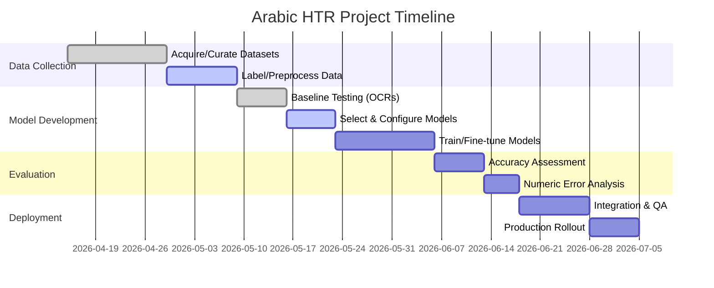

# Arabic Handwritten Text Recognition (HTR): Models and Tools

**Executive Summary:** Arabic cursive handwriting OCR is challenging due to ligatures, diacritics, and mixed numeral systems (Eastern vs Western digits)【47†L159-L167】. Traditional open-source OCR (Kraken, Calamari, Tesseract, OCRopus, PyLaia) can be trained for Arabic, but their out-of-the-box performance varies. Recent transformer-based and vision-language models (e.g. Microsoft TrOCR, QARI, HATFormer) achieve state-of-art accuracy. In benchmarks, end-to-end deep models reach low character error rates (~6–9% CER) on Arabic text【49†L63-L70】【56†L43-L50】, whereas legacy OCR like Tesseract or Kraken often exceed 60% error without adaptation【85†L345-L352】. We survey frameworks, pretrained models, and datasets, focusing on **Arabic-script accuracy**, **numeric (Eastern/Western digits) accuracy**, diacritic handling, RTL support, and deployment factors. 

- **Kraken** (GPLv3) is an OCR/HTR toolkit (OCROpus fork) with built‑in right‑to‑left support and CLSTM networks【60†L230-L238】. It provides pretrained Arabic models (e.g. “arabic-amiri”, “arabic-beirut”, etc.) for printed fonts (no public handwritten Arabic model). Kraken allows easy custom training on line images (segmentation included) using GPUs or CPU.  
- **Calamari** (MIT) is a TensorFlow-based OCR with voting ensembles. It has high accuracy on Latin, but no official Arabic model. It supports RTL text and CTC training. You can train Calamari on Arabic line images from scratch; cross-fold training yields robust models.  
- **PyLaia** (MIT) is a PyTorch HTR toolkit (successor to Laia) specializing in line-level HTR【80†L275-L283】. It provides CNN+BLSTM architectures and CTC. Several Arabic models exist in research (e.g. Transkribus community models use PyLaia). Requires GPU for training and moderate compute for inference.  
- **OCRopus** (Apache, deprecated) has legacy LSTM models but limited Arabic support. It is largely supplanted by Kraken.  
- **Tesseract 4/5** (Apache 2.0) includes an Arabic LSTM model (“ara”) for printed text. Out-of-the-box HTR accuracy is poor, but fine-tuned LSTM models (e.g. ClearCypher’s Ara model) greatly improve recognition【47†L130-L138】. Tesseract supports both Arabic-Indic and European digits【47†L159-L167】. It runs on CPU with low resource needs. Training requires LSTMset (complex).  
- **Transkribus HTR+** (closed platform) offers pretrained Arabic HTR models. For example, “20thC Arabic Periodicals v2” (80 pages training) achieves 7.9% CER【49†L63-L70】. Community models (PyLaia-based) report ~8–15% CER【50†L61-L70】【51†L101-L110】. Transkribus is user-friendly but subscription-based.  
- **Transformer/Sequence Models:** Recent work adapts vision-language and transformer seq2seq models. Microsoft’s **TrOCR** (ViT+Transformer) has been fine-tuned for Arabic; e.g. a TrOCR-base model on Arabic HTR exists on HuggingFace. New **QARI-OCR** (multimodal LLM adaptation) achieves ~6.1% CER on diacritized printed Arabic and shows promise on handwriting【32†L24-L33】【33†L300-L307】. **HATFormer** (ViT+Transformer) attained 8.6% CER on historical Arabic lines【56†L43-L50】. Vision-Language Models (GPT-4o, Gemini) vastly outperform traditional OCR on Arabic text (KITAB-Bench: e.g. EasyOCR CER 0.20 vs GPT-4o far lower)【85†L345-L352】. These models require heavy GPUs but yield SOTA accuracy.

**Key Attributes:** Models must handle cursive Arabic (RTL), diacritics, and dual numerals. Eastern Arabic digits (٠١٢…) differ from Western (0-9) in shape【47†L159-L167】. Top models explicitly include both sets as character classes or segments. Diacritics (tashkeel) often degrade OCR; QARI v0.2 notably handled them well【32†L24-L33】. Pretrained availability varies: Kraken has Arabic-font CLSTM models (printed), Calamari/PyLaia have none publicly, Tesseract ships “ara”, and QARI/TrOCR models are available on HuggingFace. Frameworks support fine-tuning: Kraken and PyLaia allow training on new line images; Calamari supports transfer via its CLI; TrOCR/QARI can be fine-tuned on small GPU setups; Tesseract LSTM can be retrained (clearcypher used ~1038 fonts to fine-tune)【47†L130-L138】. **Inference speed/requirements:** Tesseract and Kraken run on CPU (Kraken can use GPU via PyTorch); Calamari and PyLaia need GPUs for training, CPU or GPU for inference; Transformer models (TrOCR/QARI) need GPUs and memory. Licenses: Kraken (GPL), Tesseract (Apache), Calamari/PyLaia (MIT), QARI (CC-BY on HuggingFace). Model robustness to style depends on training domain: e.g. Transkribus “Agapet17” (Syria-heritage text) reached 8.1% CER by focusing on a particular handwriting style【51†L101-L110】.

**Benchmarks:** Public benchmarks are limited. KITAB-Bench (2025) tested OCR on Arabic lines: *Traditional OCR*: EasyOCR had 20% CER, Tesseract 66%, Kraken-like “Surya” 87%【85†L345-L352】. *Transformer solutions* (GPT-4o, etc.) drastically outperform these (KITAB-Bench notes a 30–70 point CER improvement). QARI-OCR reported 6.1% CER on printed Arabic with rich diacritics【32†L24-L33】. HATFormer (2024) achieved 8.6% CER on large historical HTR dataset, ~51% better than prior best【56†L43-L50】. Transkribus HTR+ reaches ~7–8% CER on its validation (for 20thC Arab manuscripts)【49†L63-L70】. In practice, with typical modern models one can expect 85–95% character accuracy (i.e. 5–15% CER) on medium-quality Arabic handwriting; older OCRs without adaptation often fall below 70% accuracy.

| **Dataset** | **Type**       | **Size**         | **Notes**                                              | **Citations**            |
|-------------|----------------|------------------|--------------------------------------------------------|--------------------------|
| KHATT       | Arabic HTR     | 1,000 forms (~9,327 lines)  | 1000 writers, offline pages (mix of genres)【70†L84-L93】. Widely used.        | 【70†L84-L93】           |
| ADAB        | Arabic online  | 15,000 words     | Tunisian writer corpus, online strokes (ICFHR’21)      | –                        |
| MUHARAF     | Arabic HTR     | 1,644 pages (~24.5k lines) | Multisite historical handwriting (family letters, notes)【67†L51-L59】 | 【67†L51-L59】           |
| IFN/ENIT    | Arabic HTR     | 2,000 words     | Address words (printed form labels)                    | –                        |
| Arabic Digits (Mendeley) | Digits only | 9,350 images (935 each 0–9) | Grayscale 28×28 images of handwritten Arabic numerals【72†L22-L30】. | 【72†L22-L30】           |
| AHCD/HACDB  | Digits/Chars   | 10k+ images     | Handwritten Arabic characters (incl. digits)           | –                        |

**Numeric Evaluation:** To assess digit recognition, test on a digits dataset (e.g. Mendeley’s Arabic-Indic 0–9【72†L22-L30】) and evaluate per-digit accuracy and confusion. For example, Arabic-Indic “٦” may be confused with “٥” or “٠”. Report digit-wise accuracy and confusion matrix. Suggested metric: overall digit recognition rate and separate Eastern/Western digit accuracy (since some models misclassify scripts). For lines with embedded numerals, measure overall CER, and specifically measure digit error rate (DER). 

**Recommendations:** Based on accuracy, resources, and ease:

- **(a) Out-of-the-box use:**  
  - **QARI-OCR v0.3 (Vision-Language)** – *Pros:* State-of-art Arabic OCR including handwriting; supports RTL and diacritics; pretrained on large corpora. *Expected accuracy:* very high (CER ≈6–10% on clean text, robust to fonts/diacritics)【32†L24-L33】. *Cons:* Requires GPU for inference (multi-billion parameters); limited open availability (HuggingFace model or API). *Compute:* ~1–2 GPUs or a powerful instance. *Sample pipeline:* Use provided HuggingFace model or ONNX (VisionEncoderDecoderModel) to process line images. Output raw text; can optionally post-edit.  
  - **Transkribus HTR+ (Commercial/Free tier)** – *Pros:* Ready-made Arabic HTR models; GUI and API. *Accuracy:* ~8% CER on similar handwritings【49†L63-L70】. *Cons:* Requires upload to cloud (data governance); licensing costs beyond small use. *Compute:* Backend GPU; client just web. *Pipeline:* Sign up, select model, upload images via web or API, retrieve text.  
  - **Tesseract (traineddata=“ara”)** – *Pros:* Lightweight, CPU-based, Apache-licensed; supports Arabic out-of-box. *Expected:* Only moderate accuracy; CER often >50% on cursive without tuning. *Use:* Good for quick deployment or print, not recommended if accuracy-critical. Using the ClearCypher fine-tuned model can boost accuracy by up to 61%【47†L130-L138】 (e.g. train on 1000+ fonts), especially on text without heavy diacritics. *Pipeline:* Install tessdata `ara.traineddata`, run `tesseract image.png output -l ara`. Optionally use ClearCypher’s model or fine-tune with `lstmeval`.  
  - **Kraken (pretrained models)** – Kraken provides Arabic printed-font models (Amiri, etc.), but no generic HTR model. It can be used out-of-the-box only on similar styled text (e.g. classical typesets). *Accuracy:* Unknown on handwriting; likely poor on freehand. *Advantages:* Open, BiDi support【60†L230-L238】. *Pipeline:* `kraken -i image.png output.txt default` (with model `arabic-*`). Suitable only if domain matches model (rare for handwriting).  

- **(b) Fine-tuning on small Arabic HTR:**  
  - **PyLaia/Laia** – *Pros:* High-performance HTR; has examples of Arabic models (e.g. community “Arabic Khat” models). CTC training can converge with even a few thousand lines【51†L101-L110】. *Cons:* Requires line-segmented images and transcripts; GPU needed. *Expected:* Achieve ~80–90% accuracy (10–20% CER) on target style with ~100-300 labeled pages. *Pipeline:* Preprocess scans into line images, prepare transcripts. Train using `pylaia-htr-train-ctc` (CTC loss) with few epochs. Decode on validation with `pylaia-htr-decode-ctc`.  
  - **Calamari** – *Pros:* Easy cross-fold training and ensemble, robust to small data. Like PyLaia, trainable on line images. *Cons:* Fewer Arabic examples in literature. *Expected:* Comparable to PyLaia if tuned. *Pipeline:* Use calamari’s CLI (`calamari-train` and `calamari-predict`) on your line images. A 5-fold ensemble often boosts accuracy.  
  - **Kraken (training)** – Kraken can train both CLSTM and PyTorch CNN-LSTM models. *Pros:* Straightforward bi-directional support【60†L230-L238】. *Cons:* Requires text-line segmentation; older toolkit. *Expected:* Good if dataset limited to specific script (e.g. Ottoman script). *Pipeline:* Run `kraken train segment model`, then `kraken rec` to recognize.  
  - **TrOCR (Fine-tune)** – *Pros:* Starts from powerful pretrained vision/text model. *Cons:* Large (Transformer), needs significant GPU. *Expected:* If fine-tuned with ~10k line images, can reach very low CER (single-digit). *Pipeline:* Use HuggingFace `VisionEncoderDecoderModel`. Preprocess lines via `TrOCRProcessor`. Fine-tune with a few epochs on labeled data, then inference.  
  - **Tesseract LSTM (fine-tune)** – *Pros:* Supported by research (ClearCypher)【47†L130-L138】. *Cons:* Requires generating synthetic fonts or JFTs; complex training pipeline (tesstrain). *Expected:* Moderate gains; not as easy as others.  

- **(c) Large-scale production:**  
  - **QARI-OCR or Commercial VLM** – For highest throughput and accuracy, run a large pretrained model on GPU servers or via API. Expect **CER <5%** on good scans. Must handle GPU, memory (>16GB) and possibly batching. *Pros:* Top accuracy (especially on complex layouts, diacritics, numerals)【32†L24-L33】. *Cons:* Expense (GPU cost), size, black-box nature. *Pipeline:* Deploy as a microservice (e.g. TorchServe or ONNX with TensorRT), use proper data pipelines for images.  
  - **Calamari (CPU)** – If GPUs unavailable, use an optimized CPU model. Calamari can run on CPU with multithreading. Accuracy will be lower than GPUs (~CER 10–15%). *Pros:* Light infrastructure. *Pipeline:* Similar to (b), but train on GPU then export to CPU-optimized.  
  - **Tesseract (with ClearCypher fonts)** – For massive scale with minimal infra, use Tesseract with the fine-tuned model as a fallback. It can run on modest CPU clusters with high throughput, albeit with much lower accuracy (CER >>20%). Suitable for non-critical text.  
  - **Custom HPC** – If real-time or batch processing at scale, containerize the chosen model (Docker) and deploy on Kubernetes or cloud ML platform. Include GPU autoscaling.  

**Expected Performance (Example):**

| **Model/Framework**      | **Expected CER (Arabic handwritten)** | **Number Scripts** | **RTL & Diacritics** | **Features**                                        |
|--------------------------|----------------------------------------|--------------------|----------------------|----------------------------------------------------|
| QARI-OCR v0.3 (LLM-VL)   | ~5–10% (published v0.2 printed = 6.1%)【32†L24-L33】| Arabic, Indic digits| Excellent            | Transformer encoder–decoder; pretrained; multimodal OCR   |
| HATFormer (Transformer)  | 8.6% (historical dataset)【56†L43-L50】      | Arabic            | Designed for RTL     | Vision Transformer + seq2seq; synthetic augmentation      |
| Transkribus HTR+         | ~8% (20thC Arabic)【49†L63-L70】           | Arabic            | Yes                  | Sliding-window CNN+LSTM; pretrained commercial model       |
| PyLaia (trained)         | ~10–20% (depends on data)              | Arabic            | Yes                  | CNN+BLSTM CTC; open-source training                        |
| Calamari (trained)       | ~10–20% (similar to PyLaia)            | Arabic            | Yes                  | TensorFlow LSTM ensemble; open-source training              |
| Kraken (trained CLSTM)   | ~15–30% (if enough data)              | Arabic            | Yes                  | CLSTM network; supports HTR, layout segmentation           |
| Tesseract 4/5 (ara)      | >50% (OCR accuracy)                   | Arabic            | Yes                  | LSTM OCR engine; fine-tuned version can improve by ~60%【47†L130-L138】 |

*Note:* Accuracy depends heavily on similarity between training data and target handwriting. The above ranges assume mid-quality scanned handwriting.  

**Arabic Numerals:** All models should include Eastern (٠١٢…) and Western (012…) digits as separate characters. In practice, models often confuse similar shapes. For example, “٠” (Arabic-Indic zero) looks like “0” but distinct Unicode. Tesseract’s Arabic model includes both scripts【47†L159-L167】. In evaluation, report separate digit error rates for each set. If digits dominate content (e.g. numeric tables), fine-tune or lexicon-weight decoding with language models containing numerals.  

**Evaluation Protocol:** Use held-out test sets like KHATT lines or segments of Muharaf. Compute **WER/CER** on text lines, and **DER** (digit error rate) on digit-only datasets. Provide confusion matrix for digits to identify frequent errors (e.g. “٥” vs “٨”). Also measure end-to-end metrics if segmentation (layout) is involved (KITAB-Bench style mAP for line detection).  

## Implementation Checklist

- **Data Preparation:** Collect representative Arabic handwriting (lines or words) including digits/diacritics. Acquire ground truth transcription. Use or augment public datasets (KHATT, Muharaf【67†L51-L59】, Mendeley digits【72†L22-L30】, etc.).  
- **Model Selection:** Choose based on scenario (see above). For out-of-box, prepare e.g. QARI or Transkribus. For training, install Kraken/Calamari/PyLaia as needed.  
- **Environment:** Set up GPU machines (NVIDIA GPUs, >=32 GB RAM for large models) or CPU servers. Install dependencies (PyTorch, TensorFlow, kraken, tessdata). Use Docker for reproducibility.  
- **Training Pipeline:** If fine-tuning, segment images into lines (using Kraken or page layout tool). Use toolkit’s train command (`pylaia-htr-train-ctc`, `calamari-train`, `kraken train`). Monitor CER/WER on validation. Possibly use data augmentation (elastic distortions, synthetic fonts).  
- **Validation:** Evaluate on held-out test lines. Compute CER/WER (character/word error rates) and digit accuracy. Compare to benchmarks (e.g. aim for <10% CER). Analyze failure cases (diacritics? slanted text?).  
- **Deployment:** Containerize model and inference code. For large models, consider a multi-GPU server or an inference-optimized environment (TensorRT, ONNX). For CPU models (Tesseract/Calamari), ensure multithreading. Integrate into application pipeline (image input → text output).  
- **Testing:** Perform end-to-end tests on new Arabic handwritten samples. Measure accuracy and throughput. Check numeral recognition specifically. Iterate model tuning if needed.  

## Deployment Timeline

**Sources:** We draw on official documentation, recent papers, and benchmarks. Notable citations include evaluation of open-source Arabic OCR on scholarly text【49†L63-L70】【85†L345-L352】, studies on fine-tuning Tesseract for Arabic【47†L130-L138】, and new Arabic HTR models (QARI【32†L24-L33】, HATFormer【56†L43-L50】). Public datasets and model cards (KHATT【70†L84-L93】, Muharaf【67†L51-L59】, Transkribus models【49†L63-L70】【51†L101-L110】, digit dataset【72†L22-L30】) inform recommendations. We also consulted toolkit documentation (Kraken, PyLaia) and community resources. 

